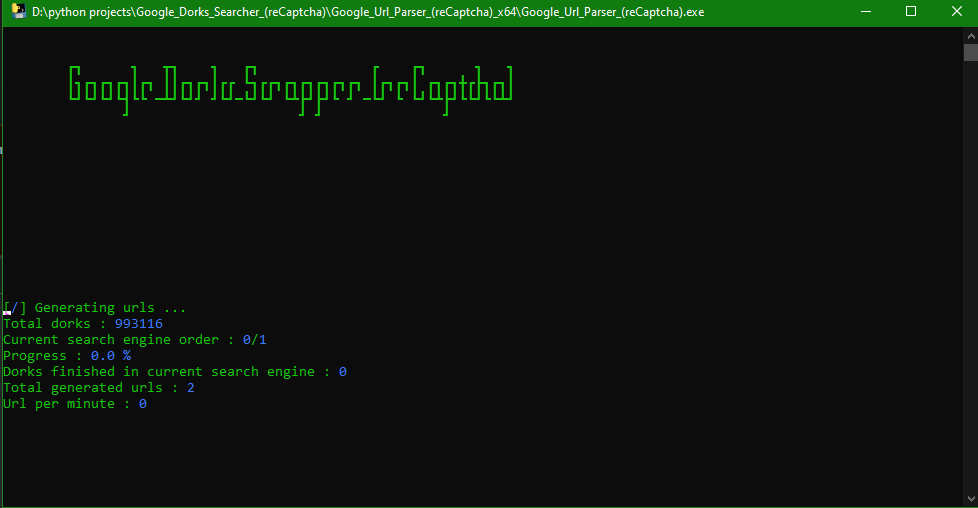

# Google URL Parser (reCaptcha)
```
        ┏┓      ┓   ┳┓    ┓   ┏┓              ┏    ┏┓      ┓   ┓
        ┃┓┏┓┏┓┏┓┃┏┓ ┃┃┏┓┏┓┃┏┏ ┗┓┏┏┓┏┓┏┓┏┓┏┓ ┃┏┓┏┓┃ ┏┓┏┓╋┏┣┓┏┓┃
        ┗┛┗┛┗┛┗┫┗┗ ━┻┛┗┛┛ ┛┗┛━┗┛┗┛ ┗┻┣┛┣┛┗ ┛ ━┗┛ ┗ ┗┛┗┻┣┛┗┗┛┗┗┻┛
               ┛                     ┛ ┛               ┛
```

This tool scrapes URLs and solves reCAPTCHA using AI. It allows you to search across multiple search engines and handle reCAPTCHA challenges effectively. 

## Features

- **URL Scraping:** Efficiently scrapes URLs from specified web pages.
- **reCAPTCHA Solving:** Utilizes AI to solve Google reCAPTCHA challenges.
- **Multi-Threading:** Configurable number of threads for faster processing.
- **Custom Dork Files:** Supports scraping based on user-provided dork files.
- **AI-Powered:** Advanced AI technology for accurate reCAPTCHA solving.
- **VPN Recommendation:** Use Hide My Ass VPN to avoid Google blocking your PC.


## Files

- **Google_Url_Parser_(reCaptcha).py:** Main Python script for URL scraping and reCAPTCHA solving.
- **Google_Url_Parser_(reCaptcha)_X64.zip:** Contains the executable for the tool.
- **Google_Url_Parser_(reCaptcha).exe:** Executable file for Windows.
- **deb_installer.bat:** Batch file for installing FFmpeg and Visual C++ Redistributable.


## Installation

### 1. Clone the Repository

```bash
git clone https://github.com/AbidAbed/Google-Scrapper.git
cd Google-Scrapper
```

### 2. Install Dependencies

- Python 3.8 or higher
- FFmpeg (for handling audio files)
- Visual C++ Redistributable (for compatibility with some libraries)


Install Python dependencies using `pip`:

```bash
pip install -r requirements.txt
```

### 3. Install FFmpeg and Visual C++ Redistributable

#### On Windows:

Run the `deb_installer.bat` script to install FFmpeg and the Visual C++ Redistributable. 

1. Open Command Prompt as Administrator.
2. Navigate to the directory where `deb_installer.bat` is located.
3. Run the following command:

   ```bash
   deb_installer.bat
   ```

The script will:
- Install FFmpeg from the official website.
- Install Visual C++ Redistributable using the provided installer.

#### On Other Platforms:

- **FFmpeg**: Follow the installation instructions for your operating system on the [FFmpeg website](https://ffmpeg.org/download.html).
- **Visual C++ Redistributable**: Usually comes pre-installed on most systems, but you can download and install it from the [Microsoft website](https://support.microsoft.com/en-us/help/2977003/the-latest-supported-visual-c-downloads).

## Usage

1. **Prepare Dorks Directory**: Create a directory with `.txt` files containing your search dorks.

2. **Run the Script**: Execute the script to start scraping URLs.

   ```bash
   python Google_Url_Parser_reCaptcha.py
   ```

3. **Follow Prompts**: The script will prompt you for various inputs:
   - **Folder for Dork Files:** Enter the path to the directory containing your dork files (`.txt` files).
   - Maximum number of threads to use
   - Number of pages to search
   - Whether to run in headless mode (Y/N)
   - Search engines to use (google, bing, ask)


4. **Result Directories:**
   - **Results:** The scraped URLs and reCAPTCHA responses will be saved in the `result` and `result/google` directories.
   - **Important:** Do not delete the `result` , `recaptcha_audios` and `result/google` directories to ensure proper functionality.

## Or you can use the executable
You can find the latest release [here](https://github.com/AbidAbed/Google-Scrapper/releases/tag/v1.0.0).

   ```bash
   1. Unzip Google_Url_Parser_(reCaptcha)_x64.zip
   2. Run Google_Url_Parser_(reCaptcha).exe
   ```
## Configuration

- **dorks_dir**: Directory containing `.txt` files with search dorks.
- **max_number_of_threads**: Number of threads to use for parallel processing.
- **number_of_pages**: Number of pages to search per dork.
- **is_headless**: Whether to run the browser in headless mode (no UI).

## Troubleshooting

- Ensure all dependencies are correctly installed.
- Check the `deb_installer.bat` script for errors if FFmpeg or Visual C++ Redistributable does not install properly.
- Refer to the [Python documentation](https://docs.python.org/3/) and [Selenium documentation](https://www.selenium.dev/documentation/en/) for additional help with setup and usage.

   
## Recommendations

- **VPN Usage:** It is recommended to use Hide My Ass VPN to avoid potential IP blocking by Google.

## Contributing

Contributions are welcome! If you encounter any issues or have suggestions for improvements, feel free to open an issue or submit a pull request.


## License

This project is licensed under the MIT License. See the `LICENSE` file for details.

## Acknowledgments

Special thanks to all contributors and the open-source community for their support.

## Example running
<p align="center">
  
</p>
